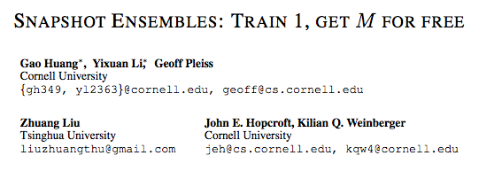
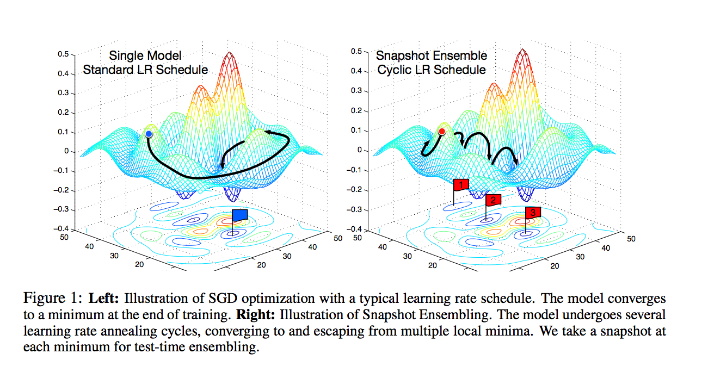
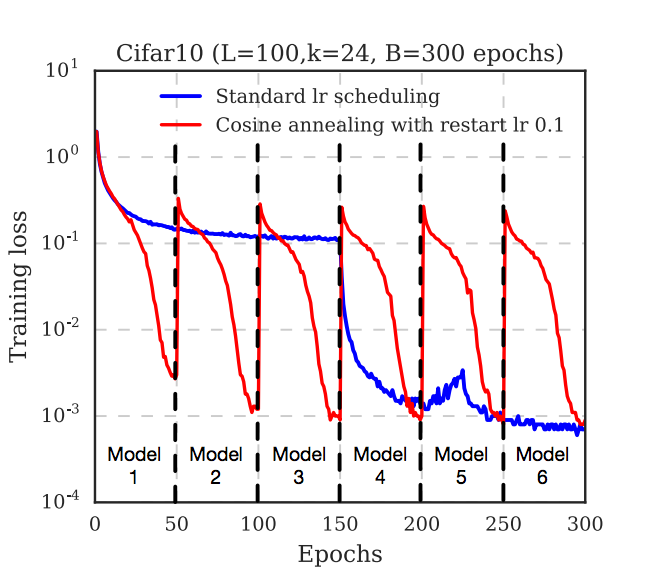

# Cyclic Cosine Annealing

## The paper
Cosine Annealing is a technique for tuning the Learning Rate introduced for the first time in the paper [*Snapshot Ensembles: Train 1, get M for free*](https://arxiv.org/abs/1704.00109) by Huang et al.

<p align="center"> 

</p>

<p align="center"> 

</p>


## The idea 
We know that the number of possible local minima in the loss surface grows exponentially with the number of parameters, and modern neural nets can have millions.
Instead of training M neural nets independently from scratch, they let SGD to converge M times to local minima. Each time the model converges, they save the weights (the snapshot) and add the corresponding network to the ensemble. We then restart the optimization with a large Learning Rate to escape the current local minimum. They use the **Cyclic Cosine Annealing schedule**, in which LR is raised and then quickly lowered following a cosine function. 

<p align="center"> 

</p>
In this plot you can see in red the LR used in this approach, which is raised and then quickly lowered at each snapshot. 


## Examples
### Keras


```python
def _cosine_anneal_schedule(self, t):
        cos_inner = np.pi * (t % (self.T // self.M))
        cos_inner /= self.T // self.M
        cos_out = np.cos(cos_inner) + 1
        return float(self.alpha_zero / 2 * cos_out)
```
you can use this function and pass it to a  `LearningRateScheduler` Callback:

```python
keras.callbacks.LearningRateScheduler(schedule=self._cosine_anneal_schedule)
```

Full example at [Keras Contrib Repo](https://github.com/keras-team/keras-contrib/blob/master/keras_contrib/callbacks/snapshot.py) (showing all code for Snapshot Ensamble and Cyclic Cosine Annealing).

### PyTorch

From the [docs](https://pytorch.org/docs/0.3.1/optim.html#torch.optim.lr_scheduler.CosineAnnealingLR), supported by default since PyTorch 0.3.1:

```python
class torch.optim.lr_scheduler.CosineAnnealingLR(optimizer, T_max, eta_min=0, last_epoch=-1)
```

## Additional Resources

Lesson 2 of [Practical Deep Learning for Coders](http://course.fast.ai/): [video](https://www.youtube.com/watch?v=JNxcznsrRb8&feature=youtu.be&t=2291)
